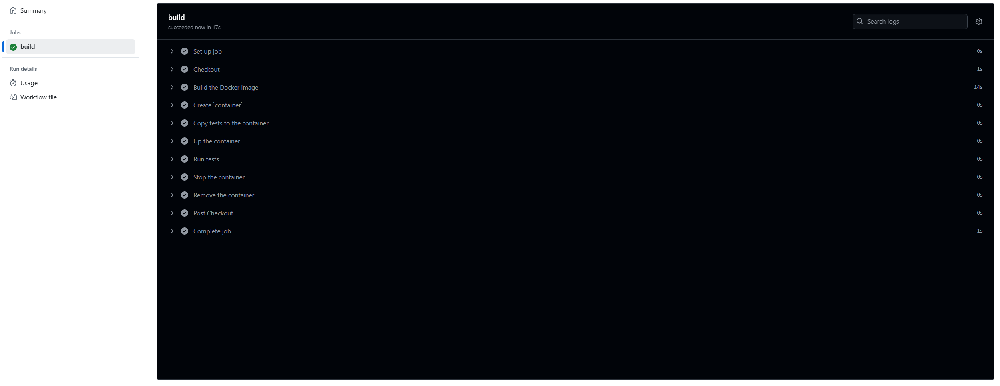

# Lucrarea de laborator nr. 8: Integrare continuă cu Github Actions
# Covrig Andrei, grupa I2301
# 2025

## Scopul lucrării

Familiarizarea cu configurarea integrării continue cu ajutorul Github Actions.

## Sarcina

Crearea unei aplicații Web, scrierea testelor pentru aceasta și configurarea integrării continue cu ajutorul Github Actions pe baza containerelor.

## Pregătire

Am instalat pe computer [Docker](https://www.docker.com/).

## Execuție

Am creat un repozitoriu `containers08` și l-am copiat pe computer.

În directorul `containers08` am creat directorul `./site`. În directorul `./site` am plasat aplicația Web pe baza PHP.

### Crearea aplicației Web

Am creat în directorul `./site` aplicația Web pe baza PHP cu următoarea structură:

```text
site
├── modules/
│   ├── database.php
│   └── page.php
├── templates/
│   └── index.tpl
├── styles/
│   └── style.css
├── config.php
└── index.php
```

Fișierul `modules/database.php` conține clasa `Database` pentru lucru cu baza de date. Pentru lucru cu baza de date am folosit SQLite. Clasa conține metodele:
```php
<?php
class Database {
    private $db;

    // __construct($path) - constructorul clasei, primește calea către fișierul bazei de date SQLite
    public function __construct($path) {
        try {
            $this->db = new PDO("sqlite:" . $path);
            $this->db->setAttribute(PDO::ATTR_ERRMODE, PDO::ERRMODE_EXCEPTION);
        } catch (PDOException $e) {
            die("Connection failed: " . $e->getMessage());
        }
    }

    // Execute($sql) - execută interogarea SQL
    public function Execute($sql) {
        try {
            $this->db->exec($sql);
            return true;
        } catch (PDOException $e) {
            return false;
        }
    }

    // Fetch($sql) - execută interogarea SQL și returnează rezultatul sub formă de tablou asociativ
    public function Fetch($sql) {
        try {
            $stmt = $this->db->query($sql);
            return $stmt->fetchAll(PDO::FETCH_ASSOC);
        } catch (PDOException $e) {
            return [];
        }
    }

    // Create($table, $data) - creează înregistrare în tabelul $table cu datele din tabloul asociativ $data și returnează identificatorul înregistrării create
    public function Create($table, $data) {
        $columns = implode(", ", array_keys($data));
        $values = ":" . implode(", :", array_keys($data));
        $sql = "INSERT INTO $table ($columns) VALUES ($values)";
        try {
            $stmt = $this->db->prepare($sql);
            $stmt->execute($data);
            return $this->db->lastInsertId();
        } catch (PDOException $e) {
            return false;
        }
    }

    // Read($table, $id) - returnează înregistrarea din tabelul $table după identificatorul $id
    public function Read($table, $id) {
        $sql = "SELECT * FROM $table WHERE id = :id";
        try {
            $stmt = $this->db->prepare($sql);
            $stmt->execute(['id' => $id]);
            return $stmt->fetch(PDO::FETCH_ASSOC);
        } catch (PDOException $e) {
            return false;
        }
    }

    // Update($table, $id, $data) - actualizează înregistrarea în tabelul $table după identificatorul $id cu datele din tabloul asociativ $data
    public function Update($table, $id, $data) {
        $set = [];
        foreach ($data as $key => $value) {
            $set[] = "$key = :$key";
        }
        $set = implode(", ", $set);
        $sql = "UPDATE $table SET $set WHERE id = :id";
        try {
            $data['id'] = $id;
            $stmt = $this->db->prepare($sql);
            return $stmt->execute($data);
        } catch (PDOException $e) {
            return false;
        }
    }

    // Delete($table, $id) - șterge înregistrarea din tabelul $table după identificatorul $id
    public function Delete($table, $id) {
        $sql = "DELETE FROM $table WHERE id = :id";
        try {
            $stmt = $this->db->prepare($sql);
            return $stmt->execute(['id' => $id]);
        } catch (PDOException $e) {
            return false;
        }
    }

    // Count($table) - returnează numărul înregistrărilor din tabelul $table
    public function Count($table) {
        $sql = "SELECT COUNT(*) as count FROM $table";
        try {
            $stmt = $this->db->query($sql);
            $result = $stmt->fetch(PDO::FETCH_ASSOC);
            return $result['count'];
        } catch (PDOException $e) {
            return 0;
        }
    }
}
```
Fișierul `modules/page.php` conține clasa `Page` pentru lucru cu paginile. Clasa conține metodele:

```php
<?php
class Page {
    private $template;

    // __construct($template) - constructorul clasei, primește calea către șablonul paginii
    public function __construct($template) {
        $this->template = $template;
    }

    // Render($data) - afișează pagina, înlocuind datele din tabloul asociativ $data în șablon.
    public function Render($data) {
        if (!file_exists($this->template)) {
            return "Template not found";
        }
        $content = file_get_contents($this->template);
        foreach ($data as $key => $value) {
            $content = str_replace("{{{$key}}}", $value, $content);
        }
        return $content;
    }
}
```

Fișierul `templates/index.tpl` conține șablonul paginii:

```html
<!DOCTYPE html>
<html lang="en">
<head>
    <meta charset="UTF-8">
    <title>{{title}}</title>
    <link rel="stylesheet" href="/styles/style.css">
</head>
<body>
    <h1>{{title}}</h1>
    <div>{{content}}</div>
</body>
</html>
```

Fișierul `styles/style.css` conține stilurile pentru pagina:

```css
body {
    font-family: Arial, sans-serif;
    margin: 20px;
}
h1 {
    color: #333;
}
div {
    margin-top: 10px;
}
```

Fișierul `index.php` conține codul pentru afișarea paginii:

```php
<?php
require_once __DIR__ . '/modules/database.php';
require_once __DIR__ . '/modules/page.php';
require_once __DIR__ . '/config.php';

$db = new Database($config["db"]["path"]);
$page = new Page(__DIR__ . '/templates/index.tpl');

$pageId = isset($_GET['page']) ? (int)$_GET['page'] : 1;
$data = $db->Read("page", $pageId);

if (!$data) {
    $data = ['title' => 'Error', 'content' => 'Page not found'];
}

echo $page->Render($data);
```

Fișierul `config.php` conține setările pentru conectarea la baza de date:

```php
<?php
$config = [
    "db" => [
        "path" => "/var/www/db/db.sqlite"
    ]
];
```

### Pregătirea fișierului SQL pentru baza de date

Am creat în rădăcina directorului `containers08` directorul `sql`. În directorul creat am creat fișierul `schema.sql` cu următorul conținut:

```sql
CREATE TABLE page (
    id INTEGER PRIMARY KEY AUTOINCREMENT,
    title TEXT,
    content TEXT
);

INSERT INTO page (title, content) VALUES ('Page 1', 'Content 1');
INSERT INTO page (title, content) VALUES ('Page 2', 'Content 2');
INSERT INTO page (title, content) VALUES ('Page 3', 'Content 3');
```

### Crearea testelor

Am creat în rădăcina directorului `containers08` directorul `./tests`. În directorul creat am creat fișierul `testframework.php` cu următorul conținut:

```php
<?php

function message($type, $message) {
    $time = date('Y-m-d H:i:s');
    echo "{$time} [{$type}] {$message}" . PHP_EOL;
}

function info($message) {
    message('INFO', $message);
}

function error($message) {
    message('ERROR', $message);
}

function assertExpression($expression, $pass = 'Pass', $fail = 'Fail'): bool {
    if ($expression) {
        info($pass);
        return true;
    }
    error($fail);
    return false;
}

class TestFramework {
    private $tests = [];
    private $success = 0;

    public function add($name, $test) {
        $this->tests[$name] = $test;
    }

    public function run() {
        foreach ($this->tests as $name => $test) {
            info("Running test {$name}");
            if ($test()) {
                $this->success++;
            }
            info("End test {$name}");
        }
    }

    public function getResult() {
        return "{$this->success} / " . count($this->tests);
    }
}
```

Am creat în directorul `./tests` fișierul `tests.php` cu următorul conținut:

```php
<?php
require_once __DIR__ . '/testframework.php';
require_once __DIR__ . '/../config.php';
require_once __DIR__ . '/../modules/database.php';
require_once __DIR__ . '/../modules/page.php';

$testFramework = new TestFramework();

// Test 1: Verificarea conexiunii la baza de date
function testDbConnection() {
    global $config;
    $db = new Database($config['db']['path']);
    return assertExpression(
        $db !== null,
        "Database connection successful",
        "Failed to connect to database"
    );
}

// Test 2: Verificarea metodei Count
function testDbCount() {
    global $config;
    $db = new Database($config['db']['path']);
    $count = $db->Count('page');
    return assertExpression(
        $count >= 3,
        "Table count is $count",
        "Table count is less than expected"
    );
}

// Test 3: Verificarea metodei Create
function testDbCreate() {
    global $config;
    $db = new Database($config['db']['path']);
    $data = ['title' => 'Test Page', 'content' => 'Test Content'];
    $id = $db->Create('page', $data);
    return assertExpression(
        $id > 0,
        "Record created with ID $id",
        "Failed to create record"
    );
}

// Test 4: Verificarea metodei Read
function testDbRead() {
    global $config;
    $db = new Database($config['db']['path']);
    $data = $db->Read('page', 1);
    return assertExpression(
        isset($data['title']) && $data['title'] === 'Page 1',
        "Read record with title Page 1",
        "Failed to read record"
    );
}

// Test 5: Verificarea metodei Update
function testDbUpdate() {
    global $config;
    $db = new Database($config['db']['path']);
    $data = ['title' => 'Updated Page', 'content' => 'Updated Content'];
    $result = $db->Update('page', 1, $data);
    $updated = $db->Read('page', 1);
    return assertExpression(
        $updated['title'] === 'Updated Page',
        "Record updated successfully",
        "Failed to update record"
    );
}

// Test 6: Verificarea metodei Delete
function testDbDelete() {
    global $config;
    $db = new Database($config['db']['path']);
    $data = ['title' => 'Page to Delete', 'content' => 'Content to Delete'];
    $id = $db->Create('page', $data);
    $result = $db->Delete('page', $id);
    $deleted = $db->Read('page', $id);
    return assertExpression(
        $result && !$deleted,
        "Record deleted successfully",
        "Failed to delete record"
    );
}

// Test 7: Verificarea metodei Render din clasa Page
function testPageRender() {
    $page = new Page(__DIR__ . '/../templates/index.tpl');
    $data = ['title' => 'Test Title', 'content' => 'Test Content'];
    $output = $page->Render($data);
    return assertExpression(
        strpos($output, 'Test Title') !== false && strpos($output, 'Test Content') !== false,
        "Page rendered correctly",
        "Failed to render page"
    );
}

// Adăugarea testelor
$testFramework->add('Database connection', 'testDbConnection');
$testFramework->add('Table count', 'testDbCount');
$testFramework->add('Data create', 'testDbCreate');
$testFramework->add('Data read', 'testDbRead');
$testFramework->add('Data update', 'testDbUpdate');
$testFramework->add('Data delete', 'testDbDelete');
$testFramework->add('Page render', 'testPageRender');

// Rularea testelor
$testFramework->run();
echo $testFramework->getResult();
```

### Crearea Dockerfile

Am creat în directorul rădăcină al proiectului fișierul `Dockerfile` cu următorul conținut:

```dockerfile
FROM php:7.4-fpm as base

RUN apt-get update && \
    apt-get install -y sqlite3 libsqlite3-dev && \
    docker-php-ext-install pdo_sqlite

VOLUME ["/var/www/db"]

COPY sql/schema.sql /var/www/db/schema.sql

RUN echo "prepare database" && \
    cat /var/www/db/schema.sql | sqlite3 /var/www/db/db.sqlite && \
    chmod 777 /var/www/db/db.sqlite && \
    rm -rf /var/www/db/schema.sql && \
    echo "database is ready"

COPY site /var/www/html
```

### Configurarea Github Actions

Am creat în directorul rădăcină al proiectului fișierul `.github/workflows/main.yml` cu următorul conținut:

```yaml
name: CI

on:
  push:
    branches:
      - main

jobs:
  build:
    runs-on: ubuntu-latest
    steps:
      - name: Checkout
        uses: actions/checkout@v4
      - name: Build the Docker image
        run: docker build -t containers08 .
      - name: Create container
        run: docker create --name container --volume database:/var/www/db containers08
      - name: Copy tests to the container
        run: docker cp ./tests container:/var/www/html
      - name: Start the container
        run: docker start container
      - name: Run tests
        run: docker exec container php /var/www/html/tests/tests.php
      - name: Stop the container
        run: docker stop container
      - name: Remove the container
        run: docker rm container
```

## Pornire și testare

Am trimis modificările în repozitoriul și m-am asigurat că testele trec cu succes. Pentru aceasta, am trecut la fila `Actions` în repozitoriu și am așteptat finalizarea sarcinii.



## Pregătirea raportului

Am creat în directorul `containers07` fișierul `README.md` care conține executarea pas cu pas a proiectului.

## Răspuns la întrebări

1. Ce este integrarea continuă?

Integrarea continuă (CI) este o practică de dezvoltare software în care modificările de cod sunt integrate frecvent într-un repozitoriu comun, iar testele automate sunt rulate pentru a verifica corectitudinea codului. Scopul este de a detecta rapid erorile și de a asigura calitatea codului.

2. Pentru ce sunt necesare testele unitare? Cât de des trebuie să fie executate?

Testele unitare verifică funcționalitatea individuală a componentelor unei aplicații. Acestea sunt necesare pentru a asigura că fiecare parte a codului funcționează corect și pentru a preveni introducerea de erori. Testele unitare trebuie rulate automat la fiecare modificare a codului.

3. Care modificări trebuie făcute în fișierul `.github/workflows/main.yml` pentru a rula testele la fiecare solicitare de trage (Pull Request)?

Pentru a rula testele la fiecare Pull Request, se adaugă evenimentul `pull_request` în secțiunea `on`. Modificarea ar fi:
```yaml
on:
  push:
    branches:
      - main
  pull_request:
    branches:
      - main
```
4. Ce trebuie adăugat în fișierul `.github/workflows/main.yml` pentru a șterge imaginile create după testare?

Pentru a șterge imaginea Docker după testare, se adaugă un pas care folosește comanda `docker rmi`:
```yaml
- name: Remove Docker image
  run: docker rmi containers08
```

## Concluzii
Lucrarea de laborator a oferit o înțelegere a procesului de configurare a integrării continue utilizând Github Actions și Docker, prin crearea unei aplicații web bazate pe PHP, dezvoltarea testelor unitare și automatizarea procesului de testare într-un mediu containerizat. Testarea automată și integrarea continuâ joacă un rol important în dezvoltarea software modernă, contribuind la îmbunătățirea calității codului, reducerea erorilor și eficientizarea colaborării în echipă. 

## Bibliografie
1. [Continuous Integration, Wikipedia](https://en.wikipedia.org/wiki/Continuous_integration)
2. [Github Actions](https://docs.github.com/en/actions)
3. [Docker](https://www.docker.com/)
4. [Continuous integration with Docker, Docker](https://docs.docker.com/build/ci/)
5. [Introduction to GitHub Actions, Docker](https://docs.docker.com/build/ci/github-actions/)
